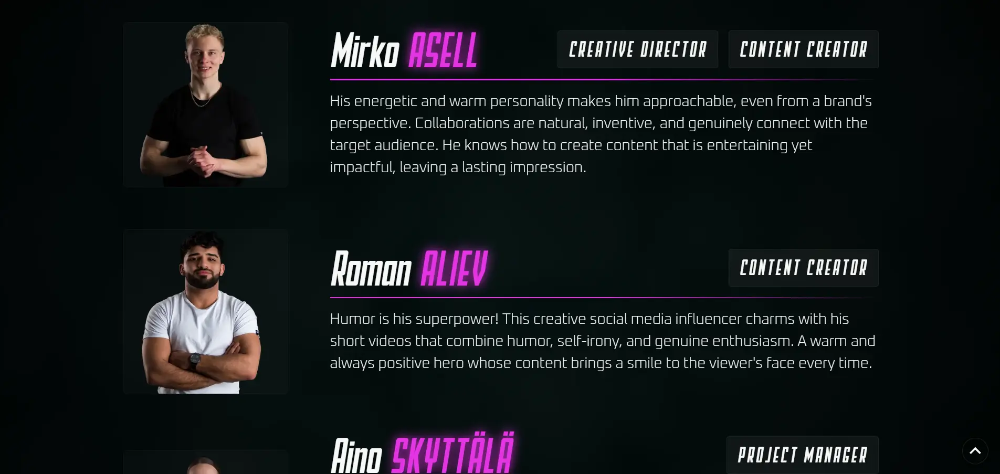
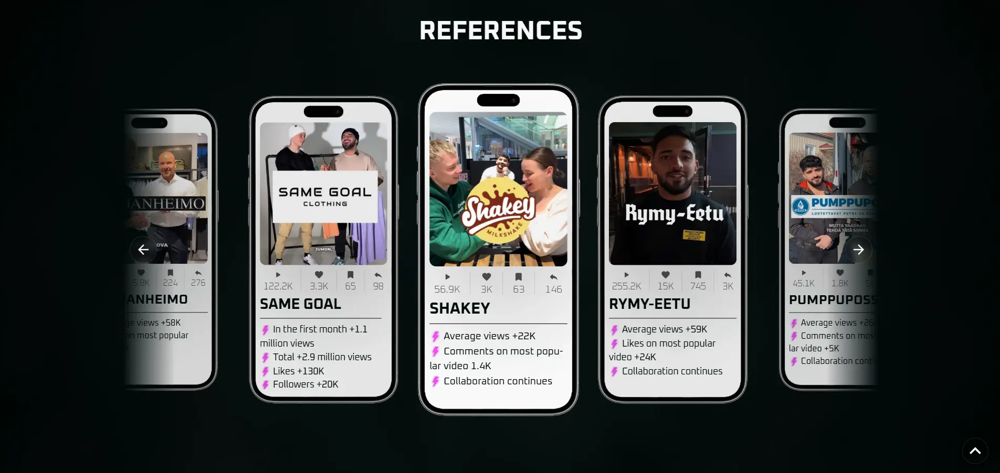
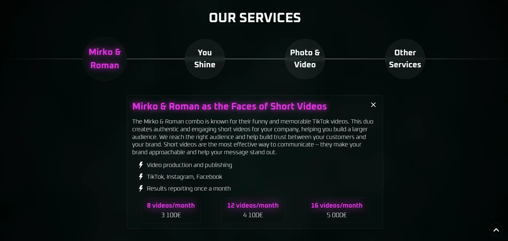
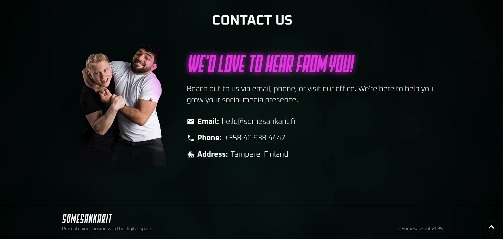

# Somesankarit Landing Page

This project is a landing page for the Social Media Marketing agency **Somesankarit**. It is built using React and Vite, with Material-UI for styling and components.

## Accessing Page

The landing page is currently hosted publically using Netlify on this url: [somesankarit.netlify.app](https://somesankarit.netlify.app/). Instructions on how to run the project locally are placed below.

## Screenshots







## Project Structure

- **src/components**: Reusable components such as buttons, cards, app bar, and footer (e.g., `CustomAppBar`, `CustomFooter`, `AccentButton`).
- **src/sections**: Different sections of the website including `Intro`, `About`, `Team`, etc.
- **src/hooks**: Custom hooks, currently only `useScreenSize`.
- **src/styles**: Custom theme, CSS color variables and font definition files.

## Getting Started

### Prerequisites

- Node.js (v18.18.0 or higher)
- npm or yarn

### Installation

1. Clone the repository:

   ```bash
   git clone https://github.com/AlexFedchin/Somesankarit-Landing.git
   cd Somesankarit-Landing
   ```

2. Install dependencies:
   ```bash
   npm install
   # or
   yarn install
   ```

### Running the Project

To start the development server, run:

```bash
npm run dev
# or
yarn dev
```

This will start the Vite development server and you can view the project at `http://localhost:5173`.

### Building for Production

To build the project for production, run:

```bash
npm run build
# or
yarn build
```

The output will be in the `dist` directory.

### Linting

To run ESLint, use:

```bash
npm run lint
# or
yarn lint
```

## Available Scripts

- `dev`: Starts the development server.
- `build`: Builds the project for production.
- `lint`: Runs ESLint to check for linting errors.

## License

This project is licensed under the MIT License.
